mvn clean test
mvn clean test "-Dsurefire.suiteXmlFiles=testng.xml"

docker-compose -f docker-compose-h2.yml up
Chaintest report available at: [http://localhost:8081/]
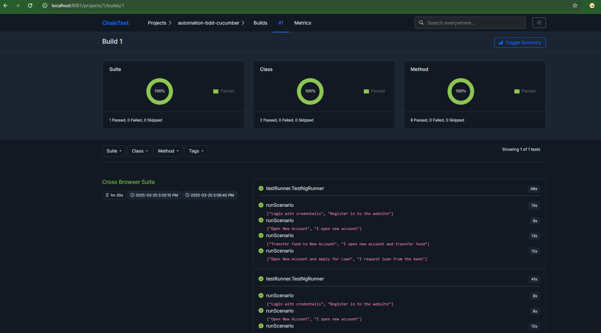
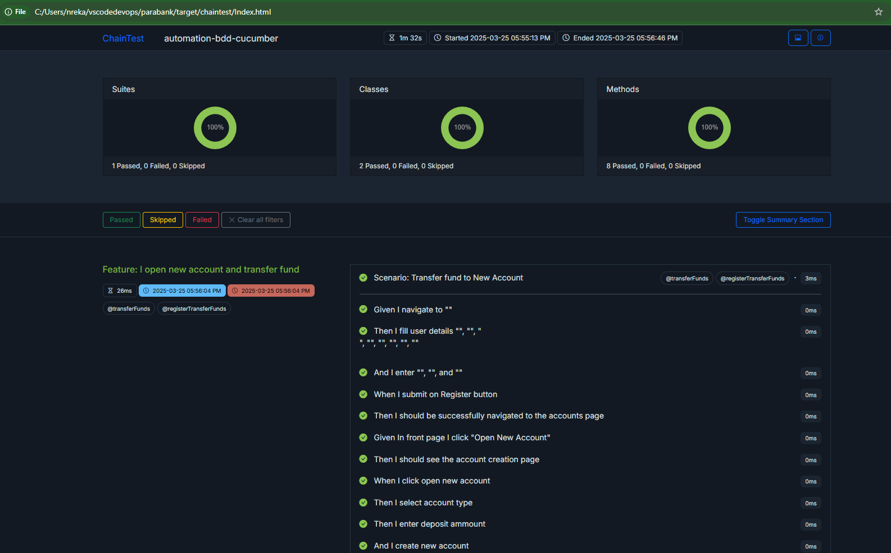

Allure Report:
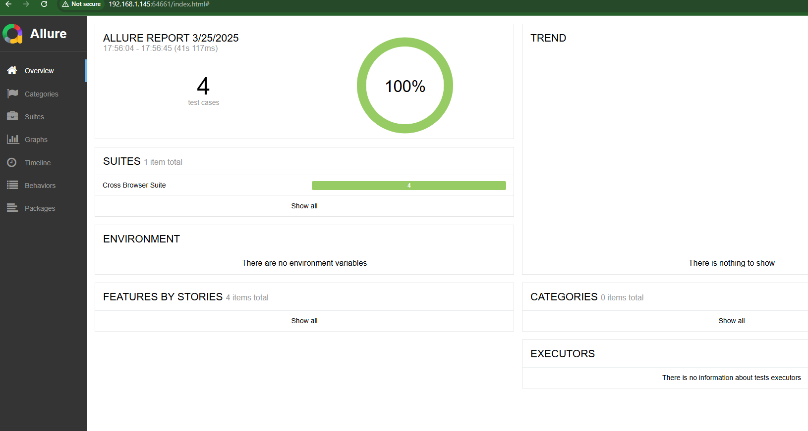

To run the tests on the local browser in headless mode:
mvn test -Dheadless=true

SeleniumGrid:
To run the tests on Selenium Grid:
mvn clean test -Dselenium.grid.url=http://localhost:5555/wd/hub
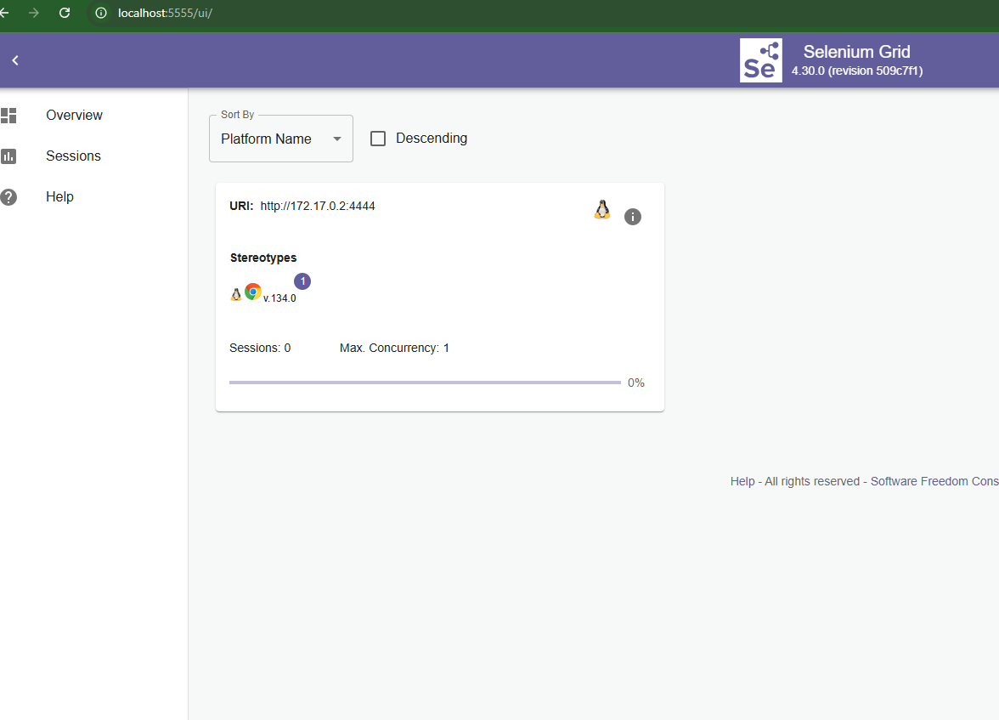

Docker-Selenium Grid:
docker-compose up -d --scale chrome=3 --scale firefox=3 && mvn clean test
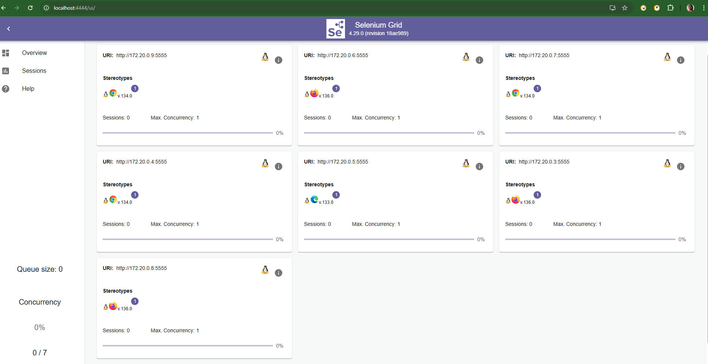

C:\Users\nreka\vscodedevops\parabank>docker run -d -p 5555:4444 --name selenium-hub selenium/standalone-chrome
7e12b8f9e7d4d46866c3e12bb8aa3499ab083e302fbae5786f294ef281b1b22d
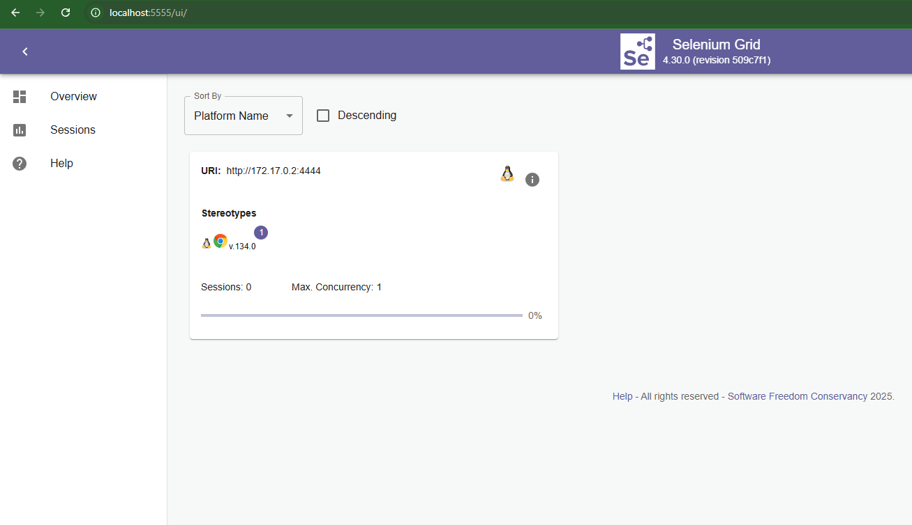

Docker image:
docker build -t parabank-bdd-cucumber-framework . 
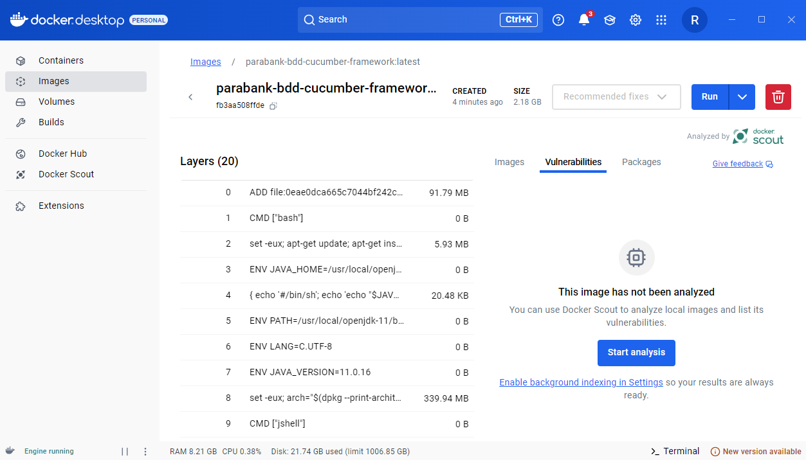
docker run --name parabank-bdd-cucumber-container parabank-bdd-cucumber-framework
OR docker run -it --name parabank-bdd-cucumber-container parabank-bdd-cucumber-framework

Lambda Test:
mvn clean test -Dlt.username=YOUR_USERNAME -Dlt.accessKey=YOUR_ACCESS_KEY
mvn clean test -Dselenium.lambdatest.enabled=true
https://automation.lambdatest.com/
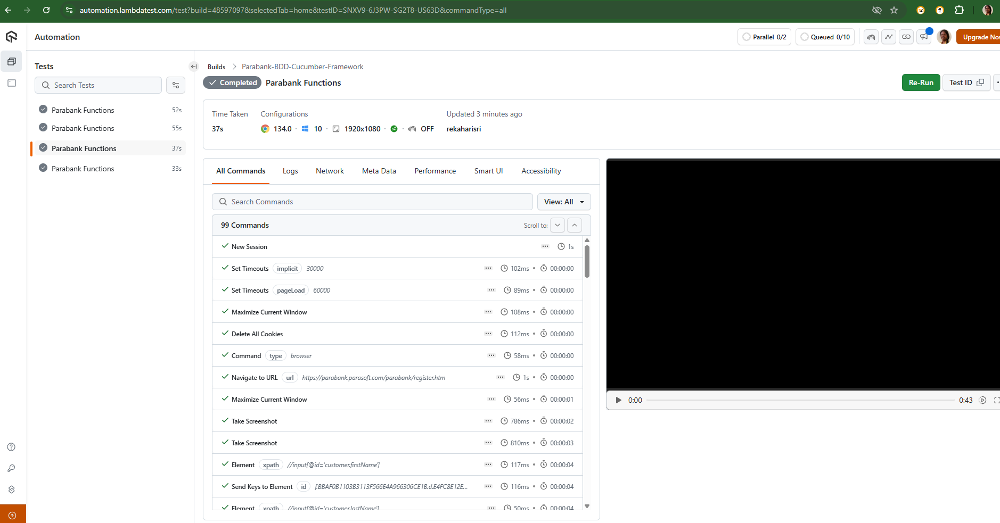

Github Actions:
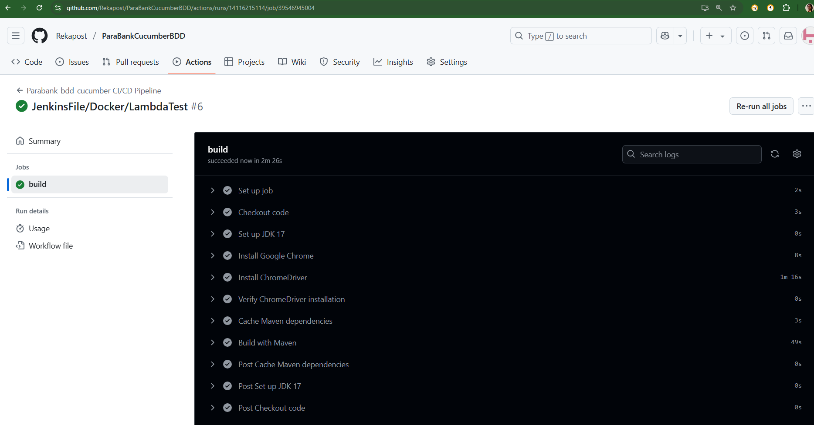

Performance Testing:
Stress Testing:
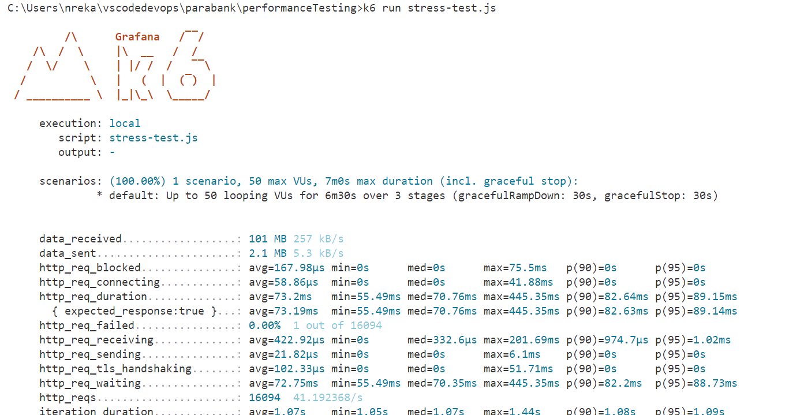
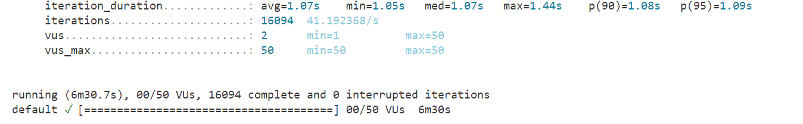

Load Test:
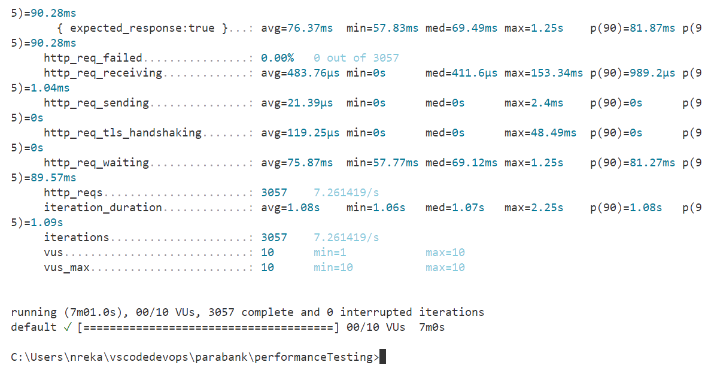

Static Code Analysis:
mvn clean verify sonar:sonar -Dsonar.projectKey=Rekapost_ParaBankCucumberBDD -Dsonar.organization=rekasonar -Dsonar.host.url=https://sonarcloud.io -Dsonar.login=${SONAR_AUTH_TOKEN}
C:\Users\nreka\vscodedevops\parabank>mvn clean verify sonar:sonar -Dsonar.projectKey=ParaBankCucumberBDD -Dsonar.organization=rekasonar -Dsonar.host.url=https://sonarcloud.io -Dsonar.login=45775b8469d4619ddd24d7e5faf3aa4e0
  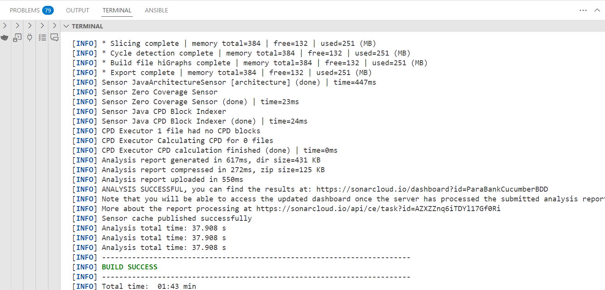
  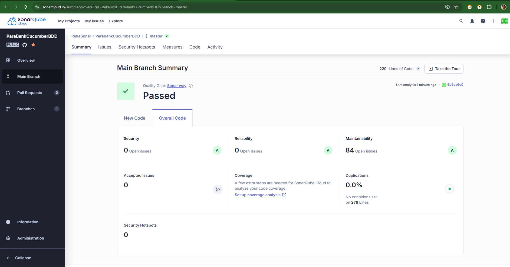
  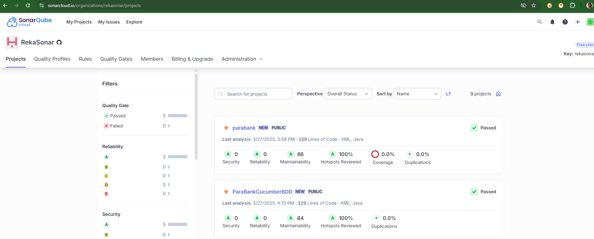

Jenkins File CI-CD:
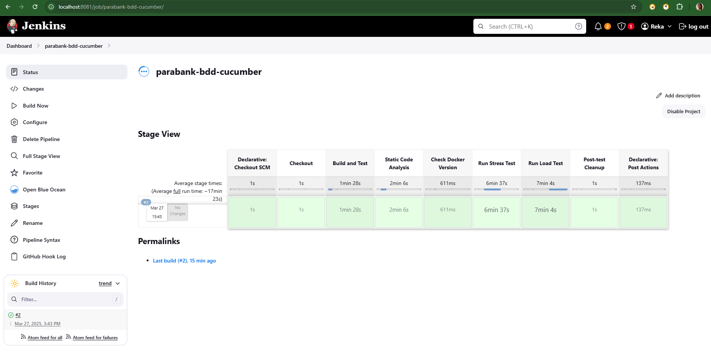  
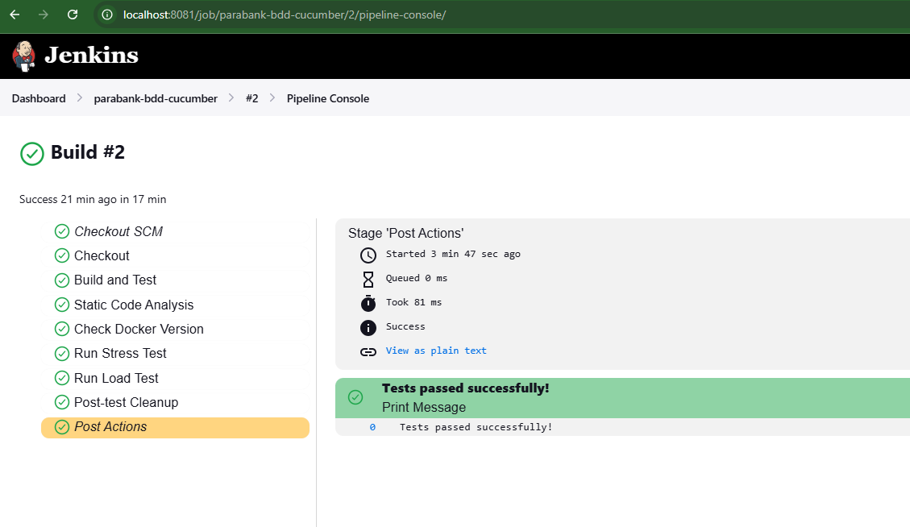
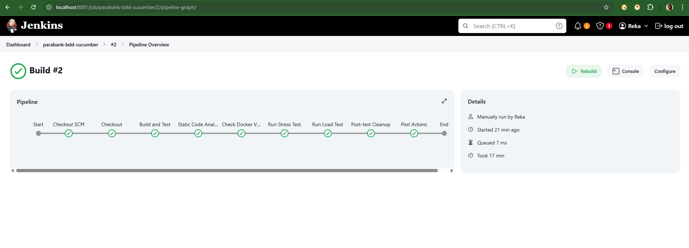

