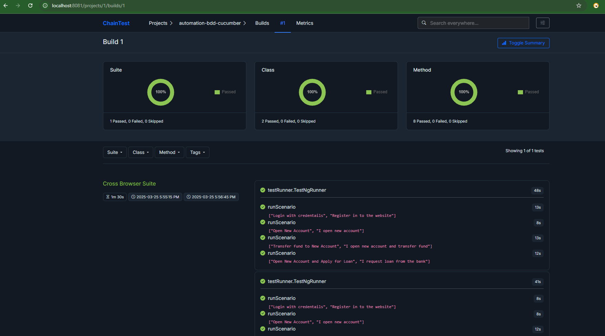
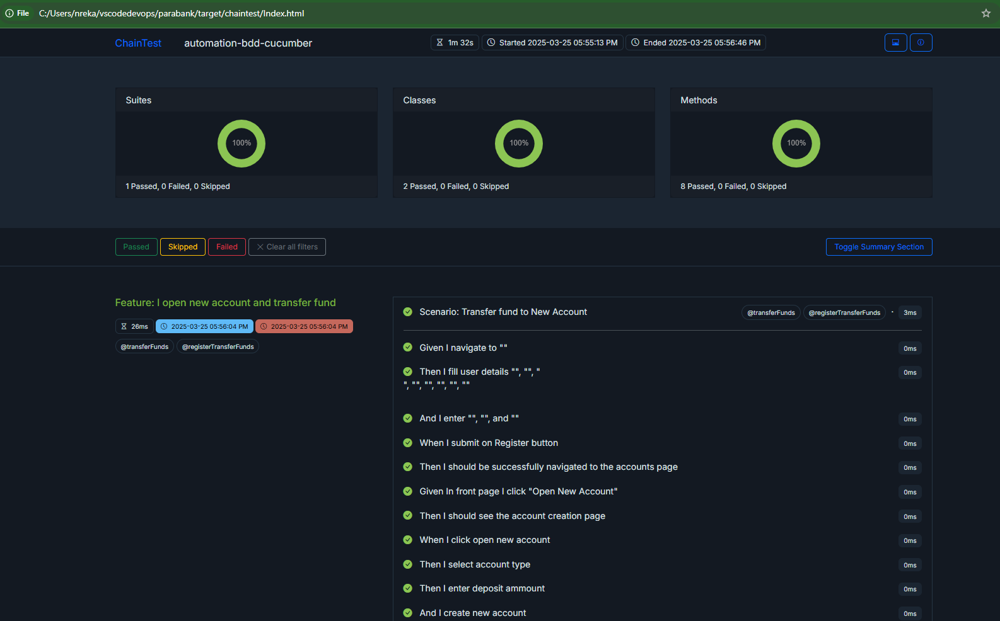
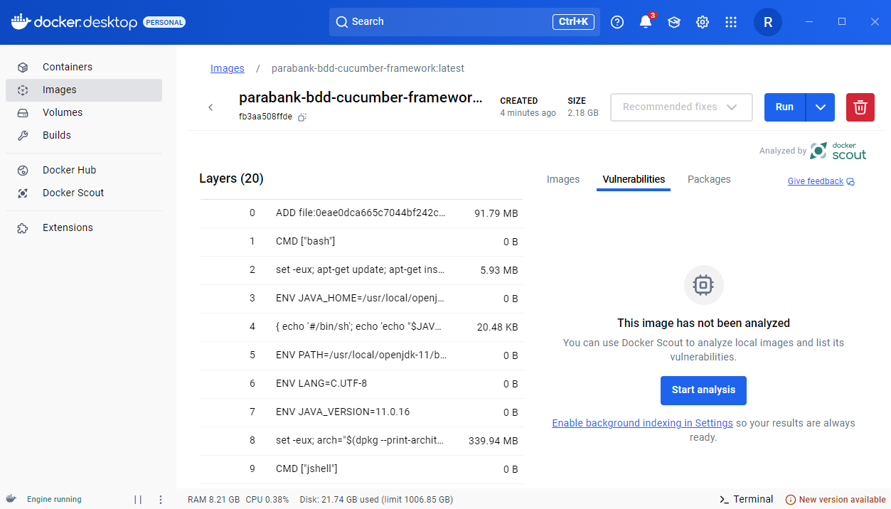

mvn clean test "-Dsurefire.suiteXmlFiles=testng.xml"
docker-compose -f docker-compose-h2.yml up
Chaintest report available at: [http://localhost:8081/]

Allure Report:

To run the tests on the local browser in headless mode:
mvn test -Dheadless=true

To run the tests on Selenium Grid:
mvn clean test -Dselenium.grid.url=http://localhost:5555/wd/hub

C:\Users\nreka\vscodedevops\parabank>docker run -d -p 5555:4444 --name selenium-hub selenium/standalone-chrome
7e12b8f9e7d4d46866c3e12bb8aa3499ab083e302fbae5786f294ef281b1b22d

docker build -t parabank-bdd-cucumber-framework . 

docker run --name parabank-bdd-cucumber-container parabank-bdd-cucumber-framework
OR docker run -it --name parabank-bdd-cucumber-container parabank-bdd-cucumber-framework

mvn clean test -Dlt.username=YOUR_USERNAME -Dlt.accessKey=YOUR_ACCESS_KEY
mvn clean test -Dselenium.lambdatest.enabled=true
https://automation.lambdatest.com/
